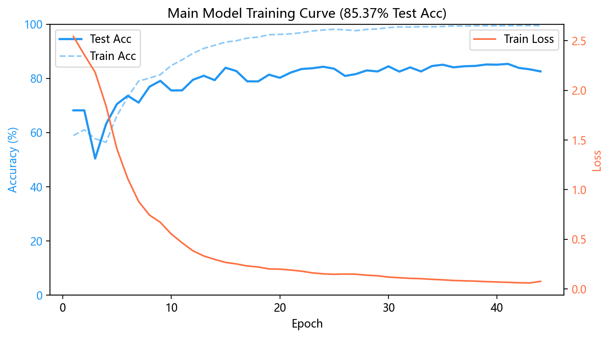
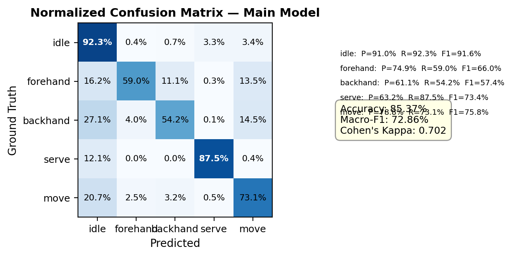

# Tennis Match Video Visual Analysis

> A computer-vision pipeline for automatic analysis of tennis match videos — it detects the court, tracks player poses, and recognizes player actions (idle / forehand / backhand / serve / movement) directly from raw match footage.

English | [简体中文](./README_zh.md)

---

## Overview

This project is an end-to-end visual analysis pipeline for tennis singles matches, organized as three sequential stages:

```
Raw match video
   │
   ├─[1] Court detection     YOLO keypoints → 14 court points → homography (top-down coords)
   │
   ├─[2] Player pose tracking  YOLO-pose for near/far players → 17-pt skeleton → EMA smoothing & gap filling
   │
   └─[3] Action recognition   Custom MSTFormer → 5-class action + keyframe detection (dual head)
```

Stage 3, **MSTFormer** (Multi-Stream Transformer), is the core contribution: it fuses three information streams — player **pose sequences**, **court geometry**, and **multi-stream visual crops** — and uses a Transformer to jointly perform **action classification** and **keyframe detection**.

## Modules

| Module | Path | Description |
| --- | --- | --- |
| **Court detection** | `src/court_detector.py`, `src/pipeline/` | YOLO 14-keypoint model; detects court points and computes the homography |
| **Pose tracking** | `src/pose_tracker.py` | YOLO-pose tracking of near/far players, with EMA smoothing and gap filling |
| **Action recognition (core)** | `src/model/mst/` | MSTFormer: dual-head (5 actions + keyframe), three-way visual-token merge, pose/crop ablation switches |
| **Person classification** | `src/model/yolo/`, `src/training/` | YOLO classifier separating near vs. far player |
| **Batch pipeline** | `src/main.py`, `src/pipeline/offline_tennis_tracker.py` | Runs the full tracking pipeline over videos, with resume support |
| **Visualization demo** | `src/demo/` | PyQt5 desktop app: video playback + 3-row timeline (GT / prediction / frames) + live inference overlay |
| **Annotation & data tools** | `src/utils/` | Action timeline annotator (Flask web), court keypoint labeler (GUI), player bbox labeler, dataset splitting, etc. |

> Per-file responsibilities are documented in [`docs/architecture_zh.md`](./docs/architecture_zh.md) (Chinese).

## Repository layout

```
tennis-vision-analysis/
├── src/                    Source code
│   ├── main.py             Batch video-processing entry point
│   ├── court_detector.py   Court detector
│   ├── pose_tracker.py     Pose tracker
│   ├── train_court_pipeline.py  Court-model training entry point
│   ├── pipeline/           Offline tracking, dataset prep, annotation refinement tools
│   ├── model/
│   │   ├── mst/            MSTFormer model, training & evaluation
│   │   └── yolo/           Person-classification model
│   ├── demo/               PyQt5 visualization demo
│   ├── utils/              Annotation & data-processing scripts
│   └── training/           Person detection/classification training scripts
├── configs/                YAML configs (court, person, MSTFormer main/ablation/hyperparams/components)
├── docs/
│   ├── architecture_zh.md  Detailed per-file notes & module dependencies
│   └── figures/            Experimental result figures
├── requirements.txt
├── LICENSE
└── README.md / README_zh.md
```

## Installation

```bash
# Python 3.10+ recommended (developed on 3.11 / 3.12)
python -m venv .venv
# Windows: .venv\Scripts\activate    Linux/macOS: source .venv/bin/activate

pip install -r requirements.txt
```

> **PyTorch / CUDA**: install `torch` / `torchvision` following the [official guide](https://pytorch.org/get-started/locally/) to match your CUDA version, then install the remaining dependencies.

## Usage

> ⚠️ This repository contains **source code, configs, and docs only**. Raw match videos, annotated datasets, and model weights (hundreds of GB in total) are not version-controlled — prepare them yourself and place them under `videos/`, `data/`, and `models/`. Path conventions live in `src/config_legacy.py` and `configs/`.

```bash
# 1) Batch-process videos and produce annotated tracking results
python src/main.py

# 2) Train the court-keypoint detection model
python src/train_court_pipeline.py

# 3) Train the MSTFormer action-recognition model (pick a config)
python src/model/mst/train.py --config configs/main.yaml

# 4) Launch the action-timeline annotator (open http://localhost:5000)
python src/utils/action_annotator.py

# 5) Launch the visualization demo
python src/demo/main.py --rally <rally_dir>
```

## Data formats

**Action annotations `annotations.json`** — one record per time segment:

```json
[
  {"start_time": 0.0,   "end_time": 4.837, "action_name": "idle",  "action_id": 0},
  {"start_time": 4.837, "end_time": 12.78, "action_name": "serve", "action_id": 3}
]
```

Action classes: `idle(0)`, `forehand(1)`, `backhand(2)`, `serve(3)`, `movement(4)`.

**Pose data `pose_data.json`** — one record per frame:

```json
{
  "frame": 0,
  "court": [[x, y, conf], ...],
  "near_player": {"bbox": [x1,y1,x2,y2], "keypoints": [[x,y,conf], ...]},
  "far_player":  {"bbox": [x1,y1,x2,y2], "keypoints": [[x,y,conf], ...]}
}
```

- `court`: 14 court keypoints; zeroed in the feature vector when confidence < 0.3
- `near_player` / `far_player`: 17-point COCO skeletons

## Results

| Training curve | Main confusion matrix |
| --- | --- |
|  |  |

More figures (ablations, hyperparameter sweeps, component comparisons, keyframe-detection curves) are in [`docs/figures/`](./docs/figures/).

## Tech stack

- **Deep learning**: PyTorch, Ultralytics YOLO11 (detection / pose / keypoints)
- **Custom model**: MSTFormer (multi-stream Transformer over pose + court geometry + visual crops)
- **CV / numerics**: OpenCV, NumPy, SciPy, scikit-learn
- **App / annotation**: PyQt5 (desktop demo), Flask (web annotator)

## License

Released under the [MIT License](./LICENSE), Copyright © 2026 Da_233.

---

> This project originated as an undergraduate thesis. The open-source release contains code and documentation only; the thesis text and copyrighted reference papers are not included.
